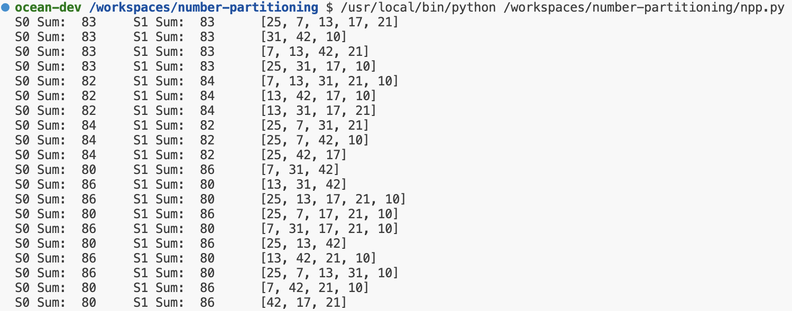

# The Number Partitioning Problem

The number partitioning problem begins with a set of numbers, S.  We must split
the set of numbers into two sets with equal sum. 

In this exercise, you are given an Ocean program outline and must create
the QUBO dictionary (Q) that is provided to the D-Wave QPU and choose
appropriate values for `chainstrength` and `numruns`.

You have successfully completed the exercise when you are able to see an output showing S0 sum and S1 sum are both
equal to 83.

To complete the program, please do the following:

- Fill in the entries in your QUBO dictionary in the `get_qubo` function. In your QUBO dictionary use 0-7 for the variable names.
- Find good values for `chainstrength` and `numruns` in the `run_on_qpu`
   function.

If you get stuck, you can first check that your QUBO is correct by setting
`chainstrength = None`.  This will use the Ocean chain
strength tuning tool, and set the chain strength for you.

### Solution `npp_solution.py`
For default chain strength, and `numruns=1000`,

## License

Released under the Apache License 2.0. See [LICENSE](LICENSE) file.
